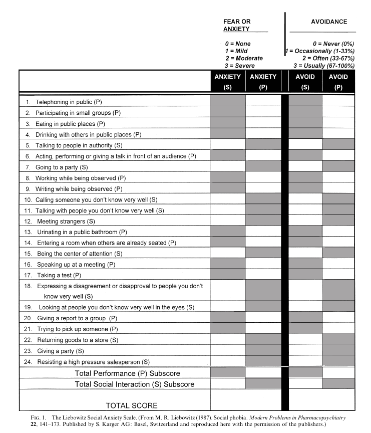

```{r setup, include=FALSE}
thematic::thematic_rmd(font = thematic::font_spec("Prompt"))
knitr::opts_chunk$set(
  fig.align = "center",
  fig.height = 4,
  fig.width = 5,
	message = FALSE,
	warning = FALSE
)
knitr::opts_knit$set(
  global.par = TRUE
)
par(mar = c(4, 4, 1, 1), cex = 0.9)
```

# Background

-   Undertake a Social Anxiety Disorder (SAD) platform trial

-   Areas of uncertainty:

    -   drug type/dose
    -   type of psychotherapy
    -   number/frequency of sessions
    -   concomitant medications, SSRIs/SNRIs

-   response-adaptive randomisation, so participants can be reassured they are more likely to receive an effective therapy

-   Bayesian, with explicit priors (*any information on expected baseline LSAS?*) and stopping/switching rules (*drop if unlikely to be optimal regimen?*)

-   Move seamlessly to a phase III trial that would assess the optimal therapy regimen (*what would be sufficient to decide a given regimen is optimal?*) to be compared to control, with long-term 'hard' outcomes (eg response/remission at 6 months - *definition?*)

Aims:

-   identify single optimal therapy regimen using short term outcomes then assess this regimen against control using long term outcomes.

-   use RAR to direct participants to better performing regimens

## Primary Outcome

Proposed primary outcome measure is the Liebowitz Social Anxiety Scale (LSAS) [@liebowitz1987].

### LSAS

The LSAS is a commonly used *clinician-administered* scale used to assess social phobia (there is also a self-report version, LSAS-SR, and a children-adolescent version, LSAS-CA).
It takes about 20-30 minutes to administer.
The scale consists of 24 items which are divided into two subscales which address social interaction (11 items) and performance (13 items) situations.
For each situation, the clinician is asked to rate the patient's level of fear and avoidance on a 4-point Likert scale.
The fear ratings range from 0 (no fear) to 3 (severe fear).
The avoidance ratings also range from 0 to 3 based on the percent of time the patient would avoid the particular situation (0 - never, 1 - occasionally [10%], 2 - often [33 - 67%], 3 - usually [67-100%]).
Clinical judgment is applied in assigning the final ratings.

An overall total score is calculated by summing the total fear and avoidance scores resulting in a scale from 0 to 144.
Alternatively, the sub-scales may be considered themselves (e.g. fear from 0 to 72, avoidance from 0 to 72, social interaction from 0 - 66, and performance from 0 to 78).

To summarise, the measure is a 24-item *Likert scale* comprised of *Likert items* graded from 0 to 3.
It yields four sub-scores (social fear, social avoidance, performance fear, performance avoidance), as well as total fear and avoidance scores, and an overall severity score.



### Outcome Definition

The proposed primary outcome derived from this measure is a 35% improvement from baseline at week 8 after randomisation.
Classifying a "responder" as someone with \>35% improvement from baseline LSAS seems to come from @taylor2018 (they say the choice was "based on the \~34% LSAS reduction seen after SSRI treatment").

There are a few issues with this outcome: it's based on a percentage change from baseline when the outcome is a baseline entry criteria, it defines an artificial "responder" using an arbitrary cut-point (35% improvement over baseline, what about someone with 34% improvement?), it converts a continuous/ordinal scale to binary throwing away information and reducing power.

If LSAS is an appropriate outcome, my preference would be to analyse the raw LSAS score with a baseline adjustment rather than analyse as a binary "responder" who achieves a "percentage change" from baseline.
That is, the outcome is LSAS at week 8 adjusting for baseline LSAS.
This could be longitudinal if multiple LSAS measurements will be taken, e.g. (baseline, week 4, week 8, week 12, say) via a longitudinal ordinal (or just standard linear) regression model on the LSAS score.
Proportion of "responders" could be investigated as secondary and can always be derived from the primary model, e.g. use ordinal/linear regression model to compute probability of reducing outcome by 35% from baseline if that quantity is of interest as a secondary between group comparison.
So quantity of interest would be the estimated relative difference in LSAS at week 8 or the estimated relative log-odds of lower LSAS at week 8 between treatments.

Same more background on LSAS:

-   threshold for probable SAD is LSAS ≥60 (@mennin2002a is the source of this threshold. They state "study sought to determine optimal cutoff values for the LSAS in making the diagnosis of SAD and determining GSAD subtype. In fact, the LSAS performed very well for these purposes. Using the LSAS total score, scores of 30 for SAD and 60 for GSAD provided the best balance between sensitivity and specificity." A similar study using the self-report version was undertaken by @rytwinski2009)

-   if using percentage change from baseline expect:

    -   10% response (i.e. 10% with \>35% improvement from baseline) under usual care (how much of this is just regression to the mean if receiving treatment is conditional on LSAS \>60?)
    -   \>40% response for a highly effective treatment

-   mean LSAS 97, SD 19 (not sure where this was from?)

Much of the detail around reliability etc. comes from @heimberg1999.
They administered the tool in 382 participants pooled from various studies of social phobia.
All participants met the DSM-III or DSM-IV criteria for social phobia diagnosis.
They found:

-   LSAS total scores were approximately normally distributed (although no distribution graphics were provided), as were fear and avoidance scores
-   Cronbach's ⍺ (internal consistency) coefficients for sub-scales and total score were high (0.81 - 0.92)
-   Mean total score of 67.2 (SD 27.5)

### Effect Sizes

What kind of relative difference in LSAS is clinically relevant?
One paper which looks at effect sizes for different treatments is @blanco2002.

## Target Population

A draft inclusion criteria was proposed:

-   Adult (18 years or older) with SAD (DSM-5 diagnosis?)
-   LSAS \> 60 (significantly unwell) at screening (why is this desirable in addition to a SAD diagnosis? Would the kind of treatments under consideration only be given conditional on LSAS \> 60?)
-   Failure to respond to 2 adequate trials (≥8 weeks) of recommended treatments, at least one pharmacological

Exclusions?

Recruitment rate: aim for 1-2 patients per week, so say 75 per year.
Feasible total SS of 150 - 200?

Expect 10% don't adhere to assigned therapy and additional 5% non-ascertainment of endpoint.

## Interventions

Proposed interventions are:

-   *Psychadelic drug domain*:

    -   none
    -   psilocybin 25mg fixed
    -   psilocybin titrated eg. 20-30mg (or 0.14-0.25 mg/kg or 20mg with option of extra 10mg after 1-2 hours)
    -   niacin 100mg (placebo-control?)

-   *Psychotherapy domain*:

    -   Standard of care: much less intensive psychotherapy (eg 1-4 hours/month)
    -   could be Type of psychotherapy or Single vs single + group e.g. single patient for all sessions vs one of the single patient preparation and integration sessions swapped for a group session

-   *Treatment sessions domain*:

    -   Number of psychedelic-assisted psychotherapy treatment sessions: 2 vs 3

-   *Concomitant meds domain*:

    -   Standard of care: large majority will be receiving SSRI/SRNI
    -   Continue SSRI/SNRI vs stop SRRI/SNRI if possible (nb tapering program to be defined)

# Sample Size

## Preliminary Numbers

The proposed primary outcome requires a 35% reduction from baseline LSAS.

```{r, echo=FALSE}
bas_LSAS <- 60:144
res_LSAS <- 0.65*bas_LSAS
par(mar = c(4, 5, 1 ,1), cex = 0.9)
plot(bas_LSAS, res_LSAS, asp = 1, type = 'l', 
     ylim = c(0, 100),
     xlab = "Baseline LSAS", ylab = "Response LSAS\nfor 35% reduction")
polygon(c(60, 60, 144, 144),
        c(0, min(res_LSAS), max(res_LSAS), 0),
        col = "grey90")
```

Ignoring any of the additional complexities, suppose the proposed primary outcome was used, where we expect 10% responders in control, and target the hypothesis that a treatment is effective if it increases responders to 40%.
We can frame this as a hypothesis test with $p_1=0.1$ and $\text H_0:p_2 = p_1$ against $\text{H}_1: p_2=0.4$.
This would correspond to an odds-ratio of 6.
The minimum sample size for $\alpha=0.05$ and $\beta=0.1$ as a function of $p_2$ are included in the following figure.

```{r echo = FALSE}
p_to_or <- function(p1, p2) {
  p1 / (1 - p1) / (p2 / (1 - p2))
}
or_to_p <- function(p1, or) {
  x <- or * p1 / (1 - p1)
  return(x / (1 + x))
}
ss_or_pow <- function(alpha = 0.05, beta = 0.1, OR = 6, p1 = 0.1) {
  p2 <- or_to_p(p1, OR)
  pibar <- (p1 + p2) / 2
  za <- qnorm(1 - alpha/2)
  zb <- qnorm(1 - beta)
  n <- 6 * (za + zb) ^ 2 / (log(OR)^2 * (1 - pibar^3 - (1 - pibar)^3))
  return(n)
}
ss_or_pre <- function(alpha, beta, w = 0.5, p1 = 0.1, p2 = 0.4) {
  pbar <- (p1 + p2) / 2
  za <- qnorm(1 - alpha/2)
  zb <- qnorm(1 - beta)
  n <- 6 * za ^ 2 / (-log((1 - w))^2 * (1 - pbar^3 - (1 - pbar)^3))
  return(n)  
}
p1 <- 0.1
p2 <- 0.4
pbar <- (p1 + p2) / 2
p <- seq(0.2, p2, 0.005)
OR <- p2 * (1 - p1) / (p1 * (1 - p2))
n <- sapply(p, \(x) power.prop.test(
  p1 = 0.1, p2 = x, sig.level = 0.025, 
  power = 0.9, alternative = "one.sided")$n)
par(mar = c(4, 4, 1 ,1), cex = 0.9)
plot(p, n, type = "l", ylim = c(0, 280), bty = 'n',
    xlab = expression(p[2]), 
    ylab = "Sample size per treatment")
lines(p, n/.95, lty = 2)
points(tail(p,1),tail(n,1))
text(tail(p,1), tail(n,1), cex = 0.0, adj = c(0.75,2.5),
     labels = paste0("n = ", ceiling(tail(n,1))))
text(tail(p,1), tail(n,1), cex = 0.0, adj = c(0.75,-2.5),
     labels = paste0("n = ", ceiling(tail(n,1)/.95)))
legend("topright", bty = "n", 
       legend = c("Required sample size", "Adjust for 5% dropout"), lty = 1:2)
```

Alternatively, we can use the LSAS score directly.
Let $Y$ be LSAS with distribution $\text{Pr}(Y=y)$ such that $\mathbb E[Y]=97$ and $\sqrt{\mathbb V[Y]} = 0.19$.
For example, the red distribution in Figure \@ref(fig:y-shift).
Suppose we expect an odds ratio of 6 for reducing LSAS score, that is, the odds of responding with a lower LSAS score under treatment is 6 compared to control.
Then the required sample size for 90% power would be 20 in each group.

```{r y-shift, echo=FALSE, fig.cap="Assumed control group distribution of LSAS (red) and treatment shifted distribution (black) under PO with OR = 6."}
library(Hmisc)
library(truncdist)
pt <- ptrunc(0:143, spec = "norm", a = 0, b = 144, mean = 97, sd = 19)
p_y <- diff(c(0, pt, 1))
m_y <- sum(0:144*p_y)
s_y <- sqrt(sum(p_y*(0:144 - m_y)^2))
odds.ratio <- 1/6
p_y2 <- pomodm(p = p_y, odds.ratio = odds.ratio)
m_y2 <- sum(0:144*p_y2)
s_y2 <- sqrt(sum(p_y2*(0:144 - m_y2)^2))
plot(0:144, p_y2, type = 'h',
     xlab = expression(Y~"(LSAS)"), 
     ylab = expression(Pr(Y~'='~y)))
abline(v = m_y2, lty = 2, lwd = 2)
points(0:144, p_y, type = 'h', col = "red")
abline(v = m_y, col = "red", lty = 2, lwd = 2)


# posamsize(p = (c(0.1,0.9) + c(0.4,0.6))/2, 
#           odds.ratio = odds.ratio, power = 0.9)
pbar <- (p_y + p_y2) / 2
posamsize(p = pbar, odds.ratio = odds.ratio, power = 0.9)
```

Example with Wilcoxon Mann-Whitney test under the assumed distributions

```{r}
res <- simplify2array(parallel::mclapply(1:2e4, \(x) {
  y1 <- sample(0:144, 20, replace = T, prob = p_y)
  y2 <- sample(0:144, 20, replace = T, prob = p_y)
  wilcox.test(y1, y2, correct = F)$p.val
}, mc.cores = 15))
round(mean(res < 0.05), 2)

res <- simplify2array(parallel::mclapply(1:2e4, \(x) {
  y1 <- sample(0:144, 20, replace = T, prob = p_y)
  y2 <- sample(0:144, 20, replace = T, prob = p_y2)
  wilcox.test(y1, y2, correct = F)$p.val
}, mc.cores = 15))
round(mean(res < 0.05), 2)
```

```{r echo=FALSE, fig.cap="Alternative assumed control group distribution of LSAS (red) and treatment shifted distribution (black) under PO with OR = 6."}
library(sn)
pt <- ptrunc(0:143, spec = "sn", a = 0, b = 144, xi = 98, omega = 20, alpha = -1)
p_y <- diff(c(0, pt, 1))
m_y <- sum(0:144*p_y)
s_y <- sqrt(sum(p_y*(0:144 - m_y)^2))
odds.ratio <- 1/6
p_y2 <- pomodm(p = p_y, odds.ratio = odds.ratio)
m_y2 <- sum(0:144*p_y2)
s_y2 <- sqrt(sum(p_y2*(0:144 - m_y2)^2))
plot(0:144, p_y2, type = 'h',
     xlab = expression(Y~"(LSAS)"), 
     ylab = expression(Pr(Y~'='~y)))
abline(v = m_y2, lty = 2, lwd = 2)
points(0:144, p_y, type = 'h', col = "red")
abline(v = m_y, col = "red", lty = 2, lwd = 2)
```

## General

Assume domains $d\in\{A,B,C,D\}$ each with interventions denoted $d_k$ for $k=1,…,K_d$.
A participant is randomised to receive a regimen $r_i$ comprised of an intervention from each domain.

RAR on the probability a regimen is best in terms of the probability of scoring lower on LSAS (or in reducing expected LSAS).

------------------------------------------------------------------------

# Changes

After the initial meeting, a number of changes were made:

- Primary endpoint to HAM-A instead of LSAS
- Instead of factorial design, consider 3 arms - usual care, Ketamine, Ketamine + therapy
- Sequential, frequent interims up to max sample size
- ideally, drop usual care as soon as evidence Ketamine options are superior, then aim to estimate relative effect of both Ketamine arms
- If Ketmaine + therapy superior to Ketamine, proceed to stage III with this arm against standard of care
- If Ketamine alone is non-inferior to Ketamine + therapy, then potentially proceed to stage III with both arms against standard of care

# References
